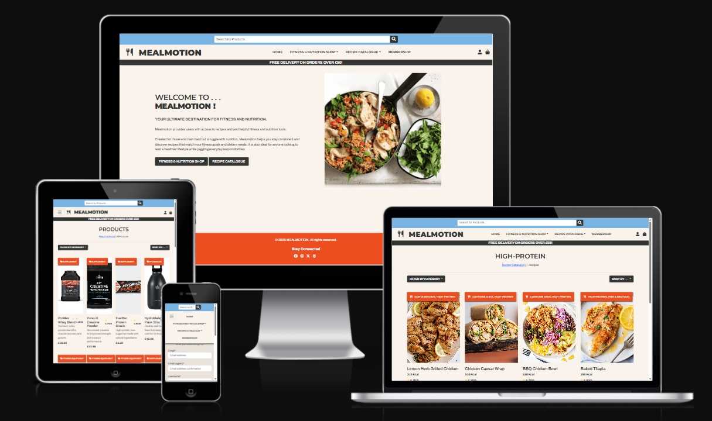

## mealmotion - Testing

[Link to deployed mealmotion Website](https://meal-motion-v2-5798e18769d4.herokuapp.com/)

## Contents
**[Automated Testing](#automated-testing)**
* [W3C Validator](#wc3-html--css-validator)
* [Python Validator](#python-validator)
* [Django Testing](#django-testing)

**[Performance Testing ( Wave & Lighthouse )](#performance-testing-lighthouse)**
* [Desktop](#desktop)
* [Mobile](#mobile)

**[Performance Results](#performance-results)**

**[Manual Testing](#manual-testing)**
* [Testing User Stories](#testing-user-stories)

**[Full Testing](#full-testing)**
* [Devices Tested On](#devices-tested-on)
* [Page Feature Testing](#page-feature-testing)

**[Solved & Known Bugs ](#solved--known-bugs)**

---

## Automated Testing
### WC3 HTML & CSS Validator
The W3C Validator was used to check and validate the HTML and CSS for all pages of the website. Validation was performed by direct input page’s web link into the tool.  

**HTML Validator**
* [Home Page](https://validator.w3.org/nu/?doc=https%3A%2F%2Fmeal-motion-v2-5798e18769d4.herokuapp.com%2F) - No errors or warnings.
* [Index Page](https://validator.w3.org/nu/?doc=https%3A%2F%2Fmeal-motion-v2-5798e18769d4.herokuapp.com%2F) - No errors or warnings.
* [Add Products](https://validator.w3.org/nu/?doc=https%3A%2F%2Fmeal-motion-v2-5798e18769d4.herokuapp.com%2Fproducts%2Fadd%2F) - No errors or warnings
* [Edit Products](https://validator.w3.org/nu/?doc=https%3A%2F%2Fmeal-motion-v2-5798e18769d4.herokuapp.com%2Fproducts%2Fedit%2F1%2F) - No errors or warnings
* [Products](https://validator.w3.org/nu/?doc=https%3A%2F%2Fmeal-motion-v2-5798e18769d4.herokuapp.com%2Fproducts%2F) - No errors or warnings.
* [Product Details](https://validator.w3.org/nu/?doc=https%3A%2F%2Fmeal-motion-v2-5798e18769d4.herokuapp.com%2Fproducts%2F1%2F) - No errors or warnings.
* [Recipes](https://validator.w3.org/nu/?doc=https%3A%2F%2Fmeal-motion-v2-5798e18769d4.herokuapp.com%2Frecipes%2F) - No errors or warnings.
* [Recipe Details](https://validator.w3.org/nu/?doc=https%3A%2F%2Fmeal-motion-v2-5798e18769d4.herokuapp.com%2Frecipes%2F1%2F) - No errors or warnings.
* [Profile](https://validator.w3.org/nu/?doc=https%3A%2F%2Fmeal-motion-v2-5798e18769d4.herokuapp.com%2Fprofile%2F) - No errors or warnings.
* [Shopping Bag](IDKKK) - No errors or warnings.
* [Checkout](https://validator.w3.org/nu/?doc=https%3A%2F%2Fmeal-motion-v2-5798e18769d4.herokuapp.com%2Fcheckout%2F) - No errors or warnings.
* [Checkout Success](done) - No errors or warnings.
* [Registration](https://validator.w3.org/nu/?doc=https%3A%2F%2Fmeal-motion-v2-5798e18769d4.herokuapp.com%2Faccounts%2Fsignup%2F) - There is an error which is derived from the use of crispy forms - not my actual code.
[Attribute Error](static/images/testing_images/attribute-error.png)
* [Login](https://validator.w3.org/nu/?doc=https%3A%2F%2Fmeal-motion-v2-5798e18769d4.herokuapp.com%2Faccounts%2Flogin%2F) - No errors or warnings.
* [Logout](https://validator.w3.org/nu/?doc=https%3A%2F%2Fmeal-motion-v2-5798e18769d4.herokuapp.com%2Faccounts%2Flogout%2F) - No errors or warnings.
* [Error Pages](https://validator.w3.org/nu/?doc=https%3A%2F%2Fmeal-motion-v2-5798e18769d4.herokuapp.com%2Fj) - There are no other errors; the validator simply identified the 404 page.

**CSS Validator** 
I just submitted the using the url through the WC3 CSS Validator.
* [CSS Validator](https://jigsaw.w3.org/css-validator/validator?uri=https%3A%2F%2Fmeal-motion-v2-5798e18769d4.herokuapp.com%2F&profile=css3svg&usermedium=all&warning=1&vextwarning=&lang=en#warnings) - No Error Found.

### Python Validator
To validate all my Python code, I used the Code Institute [Python Linter](https://pep8ci.herokuapp.com/). 
All was clear with no errors found. Below, I’ve provided Python validations for 4 of my more detailed apps as examples.  

**"products" App :**

* [admin.py](static/images/testing_images/admin-products-PL.png)
* [forms.py](static/images/testing_images/forms-products-PL.png)
* [models.py](static/images/testing_images/models-products-PL.png)
* [urls.py](static/images/testing_images/urls-products-PL.png)
* [views.py](static/images/testing_images/views-products-PL.png) 

**"bag" App :**

* [context.py](static/images/testing_images/context-bag-PL.png)
* [urls.py](static/images/testing_images/urls-bag-PL.png)
* [views.py](static/images/testing_images/views-bag-PL.png)

**"checkout" App :**

* [admin.py](static/images/testing_images/admin-check-PL.png)
* [forms.py](static/images/testing_images/forms-check-PL.png)
* [models.py](static/images/testing_images/models-check-PL.png)
* [signals.py](static/images/testing_images/signals-check-PL.png)
* [urls.py](static/images/testing_images/urls-check-PL.png)
* [views.py](static/images/testing_images/views-check-PL.png)
* [webhook_handler.py](static/images/testing_images/webhand-check-PL.png)
* [webhooks.py](static/images/testing_images/webhook-check-PL.png)

**"profiles" App :**

* [forms.py](static/images/testing_images/forms-profile-PL.png)
* [models.py](static/images/testing_images/models-profile-PL.png)
* [urls.py](static/images/testing_images/urls-profile-PL.png)
* [views.py](static/images/testing_images/views-profile-PL.png)

### Django Testing
xxx
# Performance Testing ( Wave & Lighthouse )
**Wave Contrast Checker**

I used the WAVE Contrast Checker to verify if my webpages passed accessibility standards.
All pages pass the color contrast checker, ensuring accessibility and readability for all users.
I made sure text and background colors work together.

## Performance Results 
I used Lighthouse on ChromeDevTools to test perfomance of my website on desktop - page by page.
 The results are as shown below.

### Desktop
* [Home Page](static/images/testing_images/home-PT.png) 
* [Index Page](static/images/testing_images/index-PT.png) 
* [Add Products](static/images/testing_images/addprod-PT.png) 
* [Edit Products](static/images/testing_images/editprod-PT.png) 
* [Recipes](static/images/testing_images/recipes-PT.png) 
* [Recipe Details](static/images/testing_images/recipdet-PT.png) 
* [Products](static/images/testing_images/products-PT.png) 
* [Product Details](static/images/testing_images/prodet-PT.png) 
* [Profile](static/images/testing_images/profile-PT.png) 
* [Shopping Bag](static/images/testing_images/bag-PT.png) 
* [Checkout]() 
* [Checkout Success]()
* [Registration](static/images/testing_images/signup-PT.png) 
* [Login](static/images/testing_images/signin-PT.png) 
* [Logout](static/images/testing_images/logout-PT.png) 

**To summarise :**  
Performance scores for the Index, Home, and 404 pages were some of the lowest at 73, the lowest being the 500 page at 71, which is below the desired level but passable.
I suspect that Chrome extensions may have impacted these results. 
Aside from that, most performance metrics were in the green.

SEO only dropped into the orange range on the 404 page.

Accessibility scores ranged from approximately 85 to the 90s.

Best Practices consistently scored 100, with only a few instances ranging between 90-100.

## Manual Testing
### Testing User Stories
 Refer to each Id in README.md file  
 **Accounts** 
|     User Story ID   |     How are they achieved                                                                                         |     Image                                                            |
|---------------------|-------------------------------------------------------------------------------------------------------------------|----------------------------------------------------------------------|
|     1               | The website features full authentication, allowing users to create an account using a valid username and password | [Login](static/images/testing_images/accounts-us1.png) |
|     2               | Users can access thier accounts anytime by logging in.                                                            | [Registration](static/images/testing_images/accounts-us2.png) |
|     3               | I did not manage to implement any type of subscription service on the site.                                       |   X                                                                  |
|     4               | I did not manage to implement any type of subscription service on the site.                                       |   X                                                                  |
|     5               | Once user has signed up , they will get a message to verify email.                                                | [Verification](static/images/testing_images/accounts-us5.png) |

 **Viewing & Nav** 
|     User Story ID   |     How are they achieved                                                                                                                                                    |     Image                                                              |
|---------------------|------------------------------------------------------------------------------------------------------------------------------------------------------------------------------|------------------------------------------------------------------------|
|     1               | The Products link in the navbar allows users to browse all available products, view details, and add items to their bag.                                                     | [Products](static/images/testing_images/view-us1.1.png) [Products details](static/images/testing_images/view-us1.2.png) |
|     2               | I did not manage to implement the sample catalogue.                                                                                                                          | X                                                                      |
|     3               | The quantity selector on the details page enables quick addition or removal of a specific item from the bag.                                                                 | [Selector](static/images/testing_images/view-us3.png)           |
|     4               | The Recipe link in the navbar allows users to browse all available recipes and view details.                                                                                 | [Recipes](static/images/testing_images/view-us4.1.png)   [Recipes details](static/images/testing_images/view-us4.2.png)       |
|     5               | Each recipe includes category badges to help users find options that suit their preferences. Due to time constraints, category-based sorting was not implemented.            | X                                                                      |
|     6               | Users can select product categories from the navbar dropdown or sort by category on the product page.                                                                        |   [Category](static/images/testing_images/view-us6.png)                                                                   |
|     7               | Users can use the search bar at the top of the page to find products using keywords.                                                                                         |[Search](static/images/testing_images/view-us7.png)                                                                        |
|     8               | Users can click the shopping bag icon in the navbar to be directed to the shopping bag page.                                                                                 |  [Bag](static/images/testing_images/view-us8.png)                                                                      |
|     9               | The quantity selector in the shopping bag, along with the delete (bin) icon, allows for easy updating of items and prices.                                                   |[Selector Bag](static/images/testing_images/view-us9.png)                                                                        |
|     11              | A subscription service was not implemented on the site. As a result, most features are accessible to guest users, with the exception of the profile and order history pages. |   X                                                                    |
|     12              | I did not manage to implement favouriting recipes                                                                                                                            |   X                                                                    |
|     13              | I did not manage to implement product reviews form.                                                                                                                          |   X                                                                    |
|     14              | I did not include the quiz.                                                                                                                                                  |   X                                                                    |

**Searching & Filtering Products:**
|     User Story ID   |     How are they achieved                                                                                                   |     Image                                                              |
|---------------------|-----------------------------------------------------------------------------------------------------------------------------|------------------------------------------------------------------------|
|     1               | Users can select the “Sort By…” dropdown on the product and recipe page to choose how they are ordered.                            | [Sort by](static/images/testing_images/sorting-us1.png) |
|     2               | Users can see the total number of products on the page at all times, even when products/recipes are filtered by search or category. | [Results](static/images/testing_images/sorting-us2.png)                                                                   |

**Checkout:**
|     User Story ID   |     How are they achieved                                                                                                         |     Image                                                              |
|---------------------|-----------------------------------------------------------------------------------------------------------------------------------|------------------------------------------------------------------------|
|     1               | Users can navigate to the checkout page from the shopping bag page.                                                               | [Checkout](static/images/testing_images/check-us1.png) |
|     2               | Users can update items by clicking the “Edit Bag” link, which redirects them back to the shopping bag page.                       | [Edit Bag](static/images/testing_images/check-us2.png)                                                                      |
| 3                   | Users can safely and securely complete purchases by entering their details through the Stripe payment form.                       |[Payment](static/images/testing_images/check-us3.png)                                                                         |
| 4                   | After making a payment, users see a receipt in the browser with all order summary.                                                |[Receipt](static/images/testing_images/check-us4.png)                                                                         |
| 5                   | After making a payment, users see a receipt in the browser and are informed that it will be emailed to the address they provided. | As above                                                                       |
| 6                   | If a user is logged in, they can access their profile to view their order history, including recent and past orders.              | [Receipt](static/images/testing_images/check-us5.png)                                                                          |

**Site Admin:**
|     User Story ID   |     How are they achieved                                                                                               |     Image                                                              |
|---------------------|-------------------------------------------------------------------------------------------------------------------------|------------------------------------------------------------------------|
|     1               | Logged-in admins can navigate to product management by clicking the cogs icon, allowing them to add new products.       | [Product Manage - Add](static/images/testing_images/admin-us1.png) |
|     2               | Logged-in admins can update products by clicking the edit or delete icons in the catalog or on the product detail page. | [Product Manage - Update](static/images/testing_images/admin-us2.1.png) [Product Manage - Update](static/images/testing_images/admin-us3.png)                                                                   |
| 3                   | As above                                                                                                                | As above                                                               |

## Full Testing
### Devices Tested On

I tested the website across the following devices and browsers, and it displayed correctly on all of them. The site was fully responsive and loaded properly in each case.

* **Laptop**
    * Lenovo Legion 5 15.6 in
---
* **Mobile**
    * Iphone 14 SE - Safari
    * Iphone 12
---
* **Browser**
    * Google Chrome
    * Microsoft Edge
    * Safari
    * Firefox

### Page Feature Testing
**Logged Out**

`Home`
| Feature | Expected Outcome | Testing Performed | Result | Pass/Fail |
| --- | --- | --- | --- | --- |
| Mealmotion Title | Link redirects the user back to the Home page | Title Clicked | Redirected to Homepage | Pass |
| Home Link | Link directs the user to the Home Page | Home Link Clicked | Redirected to Home Page | Pass |
| Membership Link | Link directs the user to the Registration| Membership Link Clicked |Redirected to Registration Page| Pass |
| Profile Icon Link | Link directs the user to the Login Page | Login Link Clicked | Redirected to Login Page| Pass |
| Shop & Recipe Catalogue buttons | Link directs the Shop and Recipes Page respectively| Clicked on button | Redirected to Registration Page | Pass |
| All buttons hover effect| Button color changes on hover| Hover over button | Button color changes on hover | Pass |
| Social Media Icons Footer | Link directs the user to facebook , instagram , X or Threads , depending on which icon clicked.| Click social media Icon | Redirected to the home page of social platform clicked. | Pass |
---
---
`Login & Registration`
| Feature | Expected Outcome | Testing Performed | Result | Pass/Fail |
| --- | --- | --- | --- | --- |
| Login Functionality| Sign in button redirects user to thier account if correct details entered | Entered correct username and password | User redirected to thier accont Home Page | Pass |
| Registration Functionality| Register button redirects user to thier account if correct details entered | Created a valid username and password | User redirected to thier accont Home Page | Pass |
| Username Field | Message prompting that username Field must not be empty | Field not filled out | User Presented with message , "This field is required." | Pass |
| Password Field|Message prompting that password Field must not be empty | Field not filled out | User Presented with a small popup "Please Fill In This Field." | Pass |
| Incorrect Entry of both Fields | Message prompting that username and Password must be correct | Entered correct username and password|User Presented with a "The username and/or password you specified are not correct."| Pass |
| Password (again)* Field | Throws error message if Passwords dont match | Unidentical password entered | User Presented with message , "You must type the same password each time."| Pass |

---
---

`Products Page`
| Feature | Expected Outcome | Testing Performed | Result | Pass/Fail |
| --- | --- | --- | --- | --- |
| Click Product | Link directs the user to the specific product detail page | Product clicked | Redirected to product detail page| Pass |
| Filter by category | Choosing any of dropdown categories will direct to page with only that category of product | Category clicked | Redirected to Category Page| Pass |
| Sort by | Sorting by any of the options in dropdown will reorder all products on page accordingly | Sort by option clicked | Products page reordered by option chosen| Pass |
| Search bar | Plugging keywords into searh will return products that match on page |Searched using keywords| Products with matching keyword in description or title returned to page| Pass |
| Display product qty| Qty of products always visible at top of page| Filter/search for products |Qty of products displayed and changes depending on search/filter| Pass |
| Back to top| Scrolls back to top of page when button clicked | Clicked BTT Button | Page scrolls back to the top| Pass | 

---
---

`Product Details Page`
| Feature | Expected Outcome | Testing Performed | Result | Pass/Fail |
| --- | --- | --- | --- | --- |
| Continue Shopping Button | Link directs the user back to product page | Button clicked | Redirected to product page| Pass |
| QTY Selector | Increments & decrement item qty | Clicked each button | Item qty updated| Pass |
| Add to bag | Adds qty of items selected to shopping bag | Add to bag clicked | Items added to bag| Pass |
| Bag Icon | Changes color and animates to show something is in bag |Add something to bag|Bag icon color changes and adopts animation| Pass |

---
---

`Recipe & Recipe Details Page`
| Feature | Expected Outcome | Testing Performed | Result | Pass/Fail |
| --- | --- | --- | --- | --- |
| Filter by category | Choosing any of dropdown categories will direct to page with only that category of recipe | Category clicked | Redirected to Category Page| Pass |
| Sort by | Sorting by any of the options in dropdown will reorder all products on page accordingly | Sort by option clicked | recipes page reordered by option chosen| Pass |
| Click Recipe | Link directs the user to the specific recipe detail page | Recipe clicked | Redirected to recipe detail page| Pass |
| Home Link | Link directs the user to the Home Page | Home Link Clicked | Redirected to Home Page | Pass |
| Back to top| Scrolls back to top of page when button clicked | Clicked BTT Button | Page scrolls back to the top| Pass | 

---
---

`Shopping Bag Page`
| Feature | Expected Outcome | Testing Performed | Result | Pass/Fail |
| --- | --- | --- | --- | --- |
| Bag Icon | Link directs the user to the shopping bag | Bag icon clicked | Redirected to shopping bag page| Pass |
| QTY Selector | Increments & decrement item qty | Clicked each button | Item qty updated with its subtotal , delivery price and grand total| Pass |
| Bin Icon | Delete item from bag | Bin icon clicked | Items deleted | Pass |
| Delivery | Message displayed if bag cost meet the free delivery requirements and vice versa| Updated items using selector | Message changes when bag total is below or above delivery req| Pass |
| Go to Checkout |  Link directs the user to the checkout | Clicked Checkout Button | Redirected to checkout page| Pass | 

---
---

`Checkout Page`
| Feature | Expected Outcome | Testing Performed | Result | Pass/Fail |
| --- | --- | --- | --- | --- |
| Payment Form | If any mandatory information is not filled , message pop ups | Form not filled correctly | "Please fill in this field" message | Pass |
| Email Field | If email field not filled correct, message pops up | Email field incorrectly filled correctly | "Please include an @..." message | Pass |
| Place Order button | Accept payment | Valid card and form details filled | Directed to checkout success and payment accepted | Pass |
| Invalid Card details | Invalid card details flash red | Invalid Card details filled | Invalid card details flash red | Pass |
| Edit Bag |  Link directs the user back to bag to edit | Clicked edit bag Button | Redirected to shopping bag page| Pass | 
| Save details |  If logged in check save details to have them in profile and prefilled next order | Login, check save details and complete order | Details entered reflected in profile | Pass | 

**Logged In**

`Index Page`
| Feature | Expected Outcome | Testing Performed | Result | Pass/Fail |
| --- | --- | --- | --- | --- |
| Profile Link| Link directs the user to the Profile Page| Profile Link Clicked |Redirected to Profile Page| Pass |
| Signout Link | Link directs the user to the Signout Page | Signout Link Clicked | Redirected to Signout Page| Pass |

---
---

`Profile`
| Feature | Expected Outcome | Testing Performed | Result | Pass/Fail |
| --- | --- | --- | --- | --- |
| Profile Icon | Link directs the user to the Personal Profile | Profile Icon Clicked | Redirected to Profile Page | Pass |
| Edit Information | Profile form info updated | Changed info in profile form and save | Profile form info updated | Pass |
|View Order History | Order history displayed in profile with relevant info | Make order ,recieve confirmation and navigate to profile | Order history updated | Pass |
---
---

**Login using admin credentials**
`Admin Management`
| Feature | Expected Outcome | Testing Performed | Result | Pass/Fail |
| --- | --- | --- | --- | --- |
| Profile Icon | Link directs the user to the Personal Profile | Profile Icon Clicked | Redirected to Profile Page | Pass |
| Add new Product | Add new Product to product page | Filled mandatory info and save, navigate to product page to see new product | New product added | Pass |
| Edit Product | Change details of product | Clicked edit button , updated details and confirmed | Product edited | Pass |
| Delete Product|Delete Product|Clicked delete button| Product deleted| Pass |

---
---

`Logout Page`
| Feature | Expected Outcome | Testing Performed | Result | Pass/Fail |
| --- | --- | --- | --- | --- |
| Sign Out Button | Sign Out button redirects user back to the home page and signs them out of thier account| Sign Out button clicked | User signed out | Pass |

# Solved & Known Bugs  
## Solved Bugs
| No | Bug | How I solved the issue |
| :--- | :--- | :--- |
| 1| Registration form not submitting , thus not creating new user account.| method='POST' attribute missing in form. Restored this.  [Bug-1](static/media/TESTING/bugs/bug-1.png) |
| 2 | Icon misalignment [Bug-2](static/media/TESTING/bugs/bug-2.png) |Adjusted margins and removed bag price. Chose to indicate that bag has items by adding an animation and color change to icon.|
| 3| On mobile /tablet screen sizes , when search bar is open it comes out of the nav container with icons that follow it [Bug-3](static/media/TESTING/bugs/bug-3.png)| For ease I just moved the search bar above the rest of the navbar and fixed some of the css overlaps. I also removed the JS script to toggle the searchbar when you click the search icon.|
| 4| When in admin and trying to edit products an error message displays due to cloudinary fields  [Bug-4](static/media/TESTING/bugs/bug-5.png)| I just needed to set the cloudinary environment variables in my env.py file - this got rid of my error. |
| 5| Failed to deploy my latest version of the project on heroku due to static files error.  [Bug-5](static/media/TESTING/bugs/bug-6.png)| I just needed to set the cloudinary environment variables in my env.py file - this got rid of my error. |
| 6| Internal server error on checkout page.  [Bug-5](static/media/TESTING/bugs/bug-6.png)| I just needed to set the cloudinary environment variables in my env.py file - this got rid of my error. |

## Known Bugs 

| No | Bug | Issue |
| :--- | :--- | :--- |
| 1| On mobile screen sizes , qty selector stacks vertically | [Bug-1](static/media/TESTING/bugs/bug-4.png)|
| 2 | The "Remember me" on the Login and Registration page box does not save account details.| X |
---
[Back to the Top](#mealmotion---testing)
